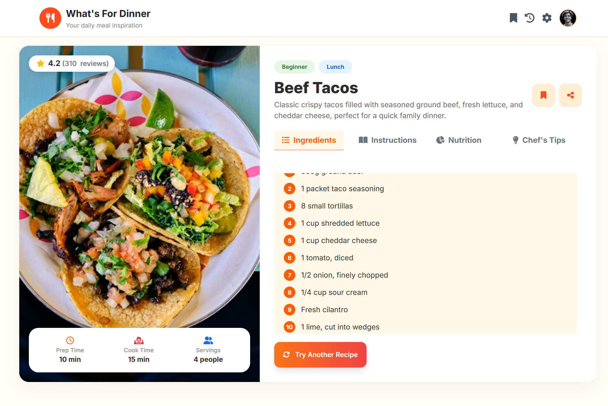

# Assignment 7 – What's For Dinner 🍽️

## 📌 Overview
**What's For Dinner** is a simple and fun JavaScript application created to solve the daily question:
> *"What should we eat today?"*

The app randomly selects a meal from a predefined list of favorite dishes, making decision-making easier and more enjoyable.

---

## 🎯 Purpose
This assignment aims to practice and apply core **JavaScript concepts** in a real-life scenario by building a small interactive application.

---

## 🚀 Live Demo
[View Live Application](https://whats-for-dinner-oa.netlify.app/)

---
## 📸 Preview Image

---

## 🧠 Concepts Applied
The project focuses on using:
- JavaScript Functions
- Objects
- Arrays
- Random Number Generation
- Basic Logic & Data Structure Design

Each meal is represented using a clear and organized structure to ensure scalability and readability.

---

## ✨ Notes
- Meals are stored in a structured format for easy access and random selection.
- The application demonstrates how JavaScript can be used to solve simple, everyday problems.
- Designed to be clean, lightweight, and beginner-friendly.

---

## ❤️ Final Note
This project was built as part of the JavaScript diploma track to strengthen problem-solving skills and practical understanding of fundamental JavaScript concepts.
