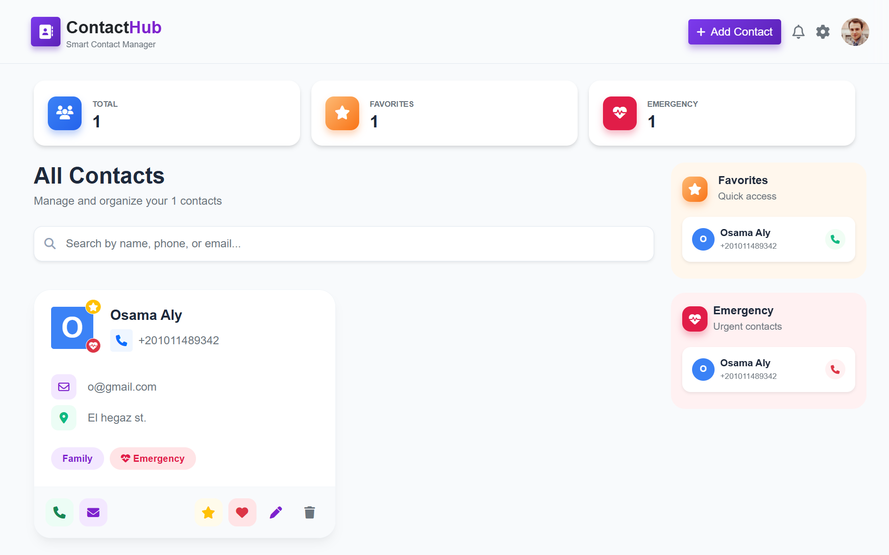

# 📇 Contact Hub | Modern Contact Management System


A professional, responsive, and dynamic contact management application built with vanilla JavaScript. It features real-time search, data persistence using Local Storage, and a modern UI powered by Bootstrap 5.

---

## 🚀 Live Demo

Check out the live application here:
### [🔗 View Live Demo](https://contacthub-oa.netlify.app/)

---

## 📸 Project Previews

### Dashboard Overview
*A comprehensive view of the application featuring the contact grid, real-time statistics, and quick action controls.*


---

## ✨ Key Features

* **⚡ CRUD Operations:** Create, Read, Update, and Delete contacts seamlessly.
* **🔍 Instant Search:** Filter contacts by Name, Phone Number, or Email in real-time.
* **📊 Dynamic Statistics:** Live counter for Total Contacts, Favorites, and Emergency contacts.
* **💾 Data Persistence:** Uses `LocalStorage` so you never lose your data on refresh.
* **🛡️ Robust Validation:** Regex-based validation for inputs to ensure clean data.
* **🎨 Professional UI/UX:**
    * Responsive Grid Layout (Bootstrap 5).
    * Dynamic Avatars based on initials.
    * Interactive Hover Effects.
    * SweetAlert2 for beautiful success/error popups.

---

## 🛠️ Technologies Used

| Technology | Purpose |
| :--- | :--- |
| **HTML5** | Semantic structure and layout. |
| **CSS3** | Custom styling, animations, and hover effects. |
| **JavaScript (ES6+)** | DOM manipulation, logic, and Local Storage handling. |
| **Bootstrap 5** | Responsive grid system and modal components. |
| **SweetAlert2** | Professional alerting and confirmation dialogs. |
| **FontAwesome** | Icons for UI elements. |

---

## 📂 Project Structure

```text
Contact-Hub/
├── index.html       # Main HTML structure
├── style.css        # Custom styles and hover effects
├── app.js           # Main application logic (CRUD, Search, Validation)
├── README.md        # Project documentation
└── screenshots/     # Images for the README
    ├── desktop-view.png
    └── mobile-view.png
```

## 🚦 How to Run Locally

1.  **Clone the Repository**
    ```bash
    git clone [https://github.com/osama-aly-oa/Contact-Hub.git](https://github.com/osama-aly-oa/Contact-Hub.git)
    ```
2.  **Navigate to the folder**
    ```bash
    cd Contact-Hub
    ```
3.  **Launch the App**
    * Simply open `index.html` in your preferred browser.
    * *Optional:* Use "Live Server" extension in VS Code for the best experience.

---

<p align="center"> Built with ❤️ by Osama Aly </p>
